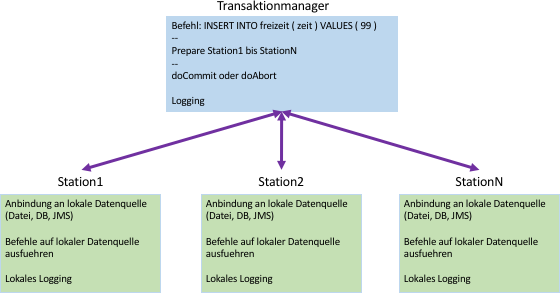

# Einführung

Die Übung soll die Grundlagen von verteilte Transaktionen mit Hilfe eines praktischen Beispiels in JAVA vertiefen.

## Ziele

Implementieren Sie in JAVA einen Transaktionsmanager, der Befehle an mehrer Stationen weitergibt und diese koordiniert.  
Mit Hilfe des 2-Phase-Commit Protokolls sollen die Transaktionen und die Antwort der Stationen verwaltet werden.  
Der Befehl kann beliebig gewählt werden und soll eine Datenquelle (Datenbank oder Datei oder Message Queue) abfragen oder veändern.

Die Kommunikation zwischen Transaktionsmanagers und der Stationen soll mit Hilfe einer Übertragungsmethode 
(IPC, RPC, Java RMI, JMS, etc) aus dem letzten Schuljahr umgesetzt werden.

## Voraussetzungen

- Grundlagen Transaktionen (allgmein, Datenbanksysteme)
- Anbindung Datenquelle in JAVA (JDBC, File, JMS)
- Kommunikation in JAVA (IPC, RPC, Java RMI, JMS)

## Aufgabenstellung

Der Transaktionsmanager läuft auf einer eigenen Instanz (bzw. eigenem Port) und stellt die Schnittstelle 
zwischen den Stationen und dem Benutzer dar. Der Benutzer gibt über die Konsole oder ein User Interface einen Befehl ein, 
der danach an alle Stationen verteilt wird. Da das 2-Phase-Commit Protokoll als Transaktionsprotokoll zugrunde liegt, 
soll der Transaktionsmanager jeweils nach einem Befehl,

- das Resultat nach der PREPARE-Phase (Bsp. 3xYES 0xNO 0xTIMEOUT) ausgeben
- welche Aktion der Transaktionsmanager danach durchfuehrt (doCommit, doAbort)
- das Resultat der COMMIT-Phase (Bsp. 3xACK 0xNCK 0xTIMEOUT)
- danach kann ein neuer Befehl eingegeben werden

### Logging

Um im Einzelfall die Transaktionen und Resultat nachverfolgen zu koennen, sollen alle Befehle und deren Resultate mit 
Timestamp geloggt werden.  
Beim Transaktionsmanager soll dokumentiert werden, welcher Befehl zu welcher Station und zu 
welchem Zeitpunkt abgesendet wurde, ebenso beim Erhalt der Antwort.  
Ebenso sollen, bei den Stationen eingehenden Befehle 
und deren Resultate bei Ausführung an der lokalen Datenquelle mitdokumentiert werden.
  
Die folgende Grafik soll den Vorgang beim 2-Phase-Commit Protokoll verdeutlichen:

### Bewertung (16 Punkte)

- verteilte Transaktion mit 1 Station (8 Punkte)
- verteilte Transaktion mit n Stationen (4 Punkte)
- Logging (in Log-Dateien) Transaktionsmanager und Stationen (2 Punkte)
- Protokoll (2 Punkte)

Alternativ zu dieser Aufgabenstellung kann ein Transaktionssystem in JEE mit Hilfe der JTA entwickelt werden.  
Details mit Prof. Micheler per Mail abklären.
